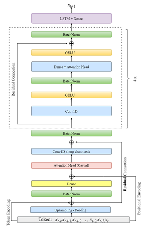

# Hybrid Transformer Model for Time Series Prediction
 

  

Put all your possibly correlated time series files into the same directory, with the headers "ws". The time_series_slicer class will pick up the columns with "ws" header. Slice them up into sliding windows with a window size  512. 

Then run:
python hybrid_transformer.py --lr LR --batch_size BATCH_SIZE --epochs EPOCHS --decay_rate DECAY_RATE

Here we picked: lr = 0.001, batch_size = 64, epochs = 15, decay_rate = -0.001

Some notes: 

-- 1) Decay rate here refers to decay rate of the learning rate,

--- 2) A single GPU is mostly enough for any kind of purposses.

---- 3) At the end of training process, the model will be saved automatically. 

---- 4) If you'ld like to replicate the results in the **aforementioned article**, [download the dataset from here!](https://www.kaggle.com/competitions/GEF2012-wind-forecasting/data"). Training the model for 5 or 6 epochs, you should reach approximately 0.992 $R^2$ (average of 7 wind farms) score on the test set.  
